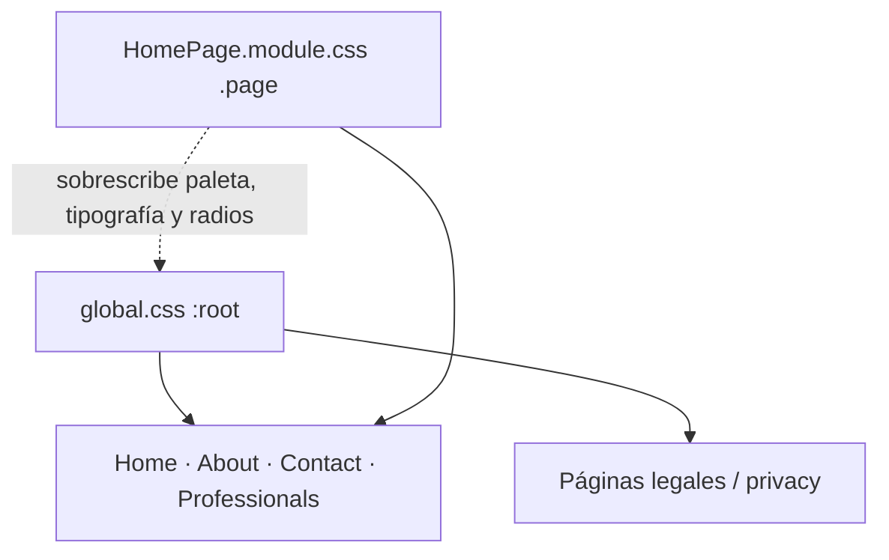

# Deepfriend — Guía de estilo y branding

> **Clean · Scientific · Modern · Minimal**
>
> Documento de referencia para identidad visual, tokens de diseño y patrones de componentes de la web marketing de Deepfriend.
>
> **Alcance:** sitio web en [dfbubbles.com](https://dfbubbles.com) (`deepfriend/`). No cubre la app nativa Android/iOS.
>
> **Audiencia:** diseño, frontend, marketing y cualquier colaborador que necesite mantener coherencia visual.
>
> **Fuente de verdad en código:** [`deepfriend/src/styles/`](deepfriend/src/styles/)

---

## Tabla de contenidos

1. [Introducción](#1-introducción)
2. [Identidad de marca](#2-identidad-de-marca)
3. [Principios de diseño visual](#3-principios-de-diseño-visual)
4. [Sistema de color](#4-sistema-de-color)
5. [Tipografía](#5-tipografía)
6. [Espaciado y layout](#6-espaciado-y-layout)
7. [Bordes, radios y sombras](#7-bordes-radios-y-sombras)
8. [Motion e interacción](#8-motion-e-interacción)
9. [Componentes y patrones UI](#9-componentes-y-patrones-ui)
10. [Mapa de páginas y aplicación del tema](#10-mapa-de-páginas-y-aplicación-del-tema)
11. [Implementación técnica](#11-implementación-técnica)
12. [Checklist de coherencia](#12-checklist-de-coherencia)
13. [Apéndice](#13-apéndice)

---

## 1. Introducción

### 1.1 Filosofía de diseño

El design system de Deepfriend se define en el propio código con cuatro adjetivos:

**Clean · Scientific · Modern · Minimal**

Esto se traduce en:

- Fondos limpios y amplios, con profundidad lograda por **espaciado** más que por sombras agresivas.
- Textura científica sutil (grid de 64px, gradientes radiales tenues).
- Tipografía con contraste emocional (serif) y funcional (sans).
- Paleta dual: **Teal** para acción y confianza, **Science Blue** para evidencia y rigor científico.

### 1.2 Arquitectura del sistema de tokens

El proyecto tiene **dos capas de tokens CSS** que conviven:



| Capa | Archivo | Ámbito | Descripción |
|---|---|---|---|
| **Global** | `deepfriend/src/styles/global.css` | `:root` en todo el sitio | Paleta base “ocean navy”, spacing scale, sombras legacy, resets |
| **Landing** | `deepfriend/src/styles/HomePage.module.css` | Clase `.page` | Paleta “Deep Ink”, Science Blue, escala tipográfica completa, radios armónicos |

**Dirección preferida para páginas nuevas de marketing:** usar la capa landing (`.page` + `homeTheme`). La capa global persiste en páginas legales y como fallback en componentes fuera de `.page`.

### 1.3 Stack de estilos

- **Next.js 16** + **React 19** + **TypeScript**
- **CSS Modules** (`*.module.css`) — un archivo CSS por sección/componente
- **Sin** Tailwind, shadcn, MUI, styled-components ni PostCSS config dedicado
- Fuentes cargadas con `next/font/google` en [`deepfriend/src/app/[lang]/layout.tsx`](deepfriend/src/app/[lang]/layout.tsx)

---

## 2. Identidad de marca

### 2.1 Arquitectura de marca

| Elemento | Nombre | Descripción |
|---|---|---|
| **Empresa / producto** | **Deepfriend** | Proyecto independiente de salud mental con IA. Siempre capitalizado. |
| **Compañero IA** | **Blue** / **Blue AI** | Submarca del asistente emocional basado en TCC/CBT |
| **Posicionamiento** | — | TCC con evidencia científica · independiente · sin inversores · datos nunca vendidos · hecho en España |
| **Dominio** | `dfbubbles.com` | Definido en [`deepfriend/src/constants/routes/routes.ts`](deepfriend/src/constants/routes/routes.ts) |
| **App Android** | `com.dfbubbles.deepfriend` | Google Play |
| **Redes** | `@dfbubbles_app` | Twitter/X en metadatos SEO |

**Emails oficiales:**

| Email | Uso |
|---|---|
| `hello@dfbubbles.com` | Contacto general, profesionales, legal |
| `help@dfbubbles.com` | Soporte al usuario |

### 2.2 Voz y tono

La voz de Deepfriend es:

- **Científica pero humana** — rigor metodológico sin frialdad clínica.
- **Empática y directa** — sin jerga vacía ni promesas sin base.
- **Transparente** — privacidad, independencia y evidencia como mensajes recurrentes.
- **Multilingüe** — ES, EN, DE con el mismo tono en [`deepfriend/src/constants/translations/translations.ts`](deepfriend/src/constants/translations/translations.ts).

#### Mensajes clave de marca

| Tema | Ejemplo (ES) | Ejemplo (EN) |
|---|---|---|
| Hero eyebrow | Compañía emocional · Basada en ciencia | Emotional companion · Science-based |
| Hero title | Siente alivio. Recupera tu calma. | Feel relief. Reclaim your calm. |
| Footer tagline | Compañía emocional con IA, basada en ciencia · Hecho con cuidado en España. | AI emotional companion, science-based · Made with care in Spain. |
| Producto Blue | Blue. Ahí cuando lo necesitas. | Blue. There when you need it. |
| Privacidad | Datos nunca vendidos | Data never sold |
| Disponibilidad | Disponible 24/7 | Available 24/7 |
| Ciencia | Centrado en TCC | CBT-centered |
| Independencia | Sin inversores · Sin letra pequeña | No investors · No small print |

#### Pilares narrativos

1. **Evidencia científica** — TCC/CBT como marco central; técnicas validadas (reestructuración cognitiva, exposición gradual, higiene del sueño).
2. **Privacidad absoluta** — HTTPS, sin venta de datos, sin terceros.
3. **Accesibilidad emocional** — Blue escucha sin juzgar, 24/7.
4. **Independencia** — Proyecto de una persona, sin inversores externos.
5. **Origen** — Hecho con cuidado en España.

### 2.3 Nomenclatura y uso del nombre

#### Reglas de escritura

| Correcto | Incorrecto |
|---|---|
| Deepfriend | deepfriend, DeepFriend, DEEPFRIEND |
| Blue | blue (como nombre propio del asistente) |
| Blue AI | BlueAI, blue-ai |
| TCC (ES/DE) / CBT (EN) | Mezclar acrónimos dentro del mismo idioma |

#### Separadores tipográficos

- Usar el **punto medio** `·` (U+00B7) como separador en eyebrows, taglines y microcopy.
- Ejemplo: `Compañía emocional · Basada en ciencia`
- En listas inline de microcopy del hero, usar `·` como separador entre items (`.micro li:not(:last-child)::after`).

#### Títulos SEO por idioma

Definidos en [`deepfriend/src/constants/seo/copy-metadata.tsx`](deepfriend/src/constants/seo/copy-metadata.tsx):

| Página | ES | EN |
|---|---|---|
| Home | Deepfriend \| Compañía emocional con IA basada en TCC | Deepfriend \| CBT-Based AI Companion for Mental Health |
| About | Acerca de Deepfriend \| Psicología basada en evidencia | About Deepfriend \| Evidence-Based Mental Health App |
| Contact | (contacto directo) | Questions, support or feedback about Deepfriend? |
| Professionals | Dashboard clínico para psicólogos | Clinical dashboard for psychologists |
| Privacy | Deepfriend nunca vende ni comparte tus datos | Deepfriend never sells or shares your data |

### 2.4 Assets de marca

#### Logotipo e iconos

| Asset | Ruta | Dimensiones en UI | Contexto |
|---|---|---|---|
| Logo principal | `deepfriend/public/icon-clean.png` | 32×32 px (navbar, footer) | Wordmark + icono en chrome del sitio |
| Favicon | `deepfriend/public/icon.png` | 32×32 | Pestaña del navegador |
| PWA 192 | `deepfriend/public/icon-192.png` | 192×192 | Manifest |
| PWA 512 | `deepfriend/public/icon-512.png` | 512×512 | Manifest |
| Apple Touch | `deepfriend/public/apple-icon.png` | 180×180 | iOS home screen |

#### Ilustraciones y badges

| Asset | Ruta | Contexto |
|---|---|---|
| Mascota Blue | `deepfriend/public/images/blue/blue-turquesa.png` | Sección Blue Product (home), hero Professionals |
| Google Play badge | `deepfriend/public/icons/google-play/logo.png` | CTAs de descarga (Portada, Cta, Footer) |
| Icono Mindfulness | `deepfriend/public/images/mindfulness/stars-white.png` | ProductExtras — tarjeta mindfulness |
| Icono Biblioteca | `deepfriend/public/images/library/library-white.png` | ProductExtras — tarjeta library |
| Foto fundador | `deepfriend/public/images/pablo/pablo.png` | Sección Team (About) |

#### Theme color

El color de marca principal **`#24998B`** se usa como theme color en:

- Viewport meta: [`layout.tsx`](deepfriend/src/app/[lang]/layout.tsx) → `themeColor: "#24998B"`
- Web manifest: [`manifest.ts`](deepfriend/src/constants/seo/manifest.ts) → `background_color` y `theme_color`
- Selección de texto (`::selection`)
- Hover del scrollbar
- CTAs primarios

### 2.5 Imagen Open Graph

Generada dinámicamente en [`deepfriend/src/app/[lang]/opengraph-image.tsx`](deepfriend/src/app/[lang]/opengraph-image.tsx):

| Propiedad | Valor |
|---|---|
| Dimensiones | 1200 × 630 px |
| Fondo | `linear-gradient(135deg, #24998B, #0f5f55)` |
| Título | "Deepfriend" — 96px, weight 700, blanco |
| Subtítulo | 40px, opacity 0.9, blanco |
| Tipografía OG | `system-ui, sans-serif` (no Cormorant/Mulish — limitación de ImageResponse) |

| Idioma | Subtítulo |
|---|---|
| ES | Tu IA científica de bienestar mental |
| EN | Your science-backed AI for mental wellness |
| DE | Deine wissenschaftliche KI für mentales Wohlbefinden |

---

## 3. Principios de diseño visual

### 3.1 Estética científica-minimalista

- Fondos predominantemente **blancos** en landing (`.page`), con secciones alternas en `#f7f6f3`.
- Profundidad mediante **espaciado vertical generoso** (`clamp(72px, 12vw, 112px)`) y paneles oscuros puntuales.
- Grid científico de fondo: líneas de 1px cada 64px, opacidad 0.022–0.025, desvanecidas con máscara radial elíptica.

### 3.2 Jerarquía tipográfica

- **Cormorant** (serif) → impacto emocional en títulos.
- **Mulish** (sans) → legibilidad en cuerpo, UI, botones y navegación.
- Highlights en títulos: palabra clave en color `--teal`.

### 3.3 Dualidad cromática

| Color | Rol semántico | Cuándo usar |
|---|---|---|
| **Teal** `#24998B` | Acción, confianza, producto, privacidad | CTAs, highlights, iconos de producto, eyebrow en paneles oscuros |
| **Science Blue** `#3337BD` | Evidencia, ciencia, rigor | Eyebrows de sección, iconos trust "science", números de tarjeta |

### 3.4 Accesibilidad

- `@media (prefers-reduced-motion: reduce)` desactiva animaciones y transiciones.
- Antialiasing activado en `html` (`-webkit-font-smoothing: antialiased`).
- Texto sobre paneles oscuros usa `--ink-on-deep` (#ffffff) y `--ink-on-deep-soft` (blanco al 62–78% opacidad).
- Contraste elevado en CTAs primarios: texto blanco sobre teal.

---

## 4. Sistema de color

### 4.1 Paleta principal (landing — referencia preferida)

Definida en `.page` dentro de [`HomePage.module.css`](deepfriend/src/styles/HomePage.module.css):

| Token | Hex | Nombre semántico | Uso |
|---|---|---|---|
| `--white` | `#ffffff` | Blanco | Texto sobre oscuro, fondos de sección |
| `--surface` | `#ffffff` | Superficie | Alias de blanco para cards |
| `--teal` / `--brand` | `#24998b` | Deep Teal | CTAs, highlights, theme-color, selección |
| `--teal-deep` / `--brand-deep` | `#1d7f73` | Teal profundo | Hover de botones teal |
| `--teal-soft` / `--brand-soft` | `#e8f5f3` | Teal suave | Fondos de iconos, badges teal |
| `--brand-tint` | `#dceee9` | Teal tint | Tintes complementarios |
| `--science` / `--accent` | `#3337bd` | Science Blue | Eyebrows ciencia, iconos trust |
| `--science-soft` | `#eeeef8` | Science suave | Fondos eyebrow hero |
| `--ice` | `#f5f7f7` | Ice White | Hover botones secundarios (no fondo de sección) |
| `--ink` | `#1a1d1d` | Deep Ink | Títulos, footer, paneles oscuros |
| `--slate` | `#6b7575` | Slate | Texto secundario, subtítulos |
| `--ink-faint` | `#8a9393` | Ink faint | Microcopy atenuado |
| `--bg-deep-2` | `#141717` | Deep 2 | Variante oscura secundaria |

#### Mapeo semántico en landing

```css
--bg: var(--surface);           /* #ffffff */
--bg-elev: var(--surface);
--bg-tint: var(--surface);
--bg-deep: var(--ink);          /* #1a1d1d */
--ink-soft: var(--slate);
--ink-mute: var(--slate);
--ink-on-deep: var(--white);
--ink-on-deep-soft: rgba(255, 255, 255, 0.62);
```

### 4.2 Paleta global (legacy / legal)

Definida en `:root` de [`global.css`](deepfriend/src/styles/global.css):

#### Superficies

| Token | Hex | Uso |
|---|---|---|
| `--bg` | `#FBFAF7` | Fondo body (warm off-white, sensación papel) |
| `--bg-elev` | `#FFFFFF` | Superficies elevadas |
| `--bg-tint` | `#F2EFE9` | Divisor sutil de sección, lang switcher bg |
| `--bg-deep` | `#0E1A2B` | Footer default, fondos oscuros |
| `--bg-deep-2` | `#13293D` | Variante navy |

#### Texto (ink scale global)

| Token | Hex | Uso |
|---|---|---|
| `--ink` | `#0E1A2B` | Títulos (páginas legales) |
| `--ink-soft` | `#3D4A5E` | Párrafos |
| `--ink-mute` | `#6B7280` | Texto atenuado |
| `--ink-faint` | `#9CA3AF` | Texto muy atenuado |
| `--ink-on-deep` | `#F6F4EE` | Texto sobre oscuro |
| `--ink-on-deep-soft` | `#B7C3D2` | Texto secundario sobre oscuro |

#### Marca (global)

| Token | Hex | Uso |
|---|---|---|
| `--brand` | `#24998B` | Teal — mismo valor que landing |
| `--brand-deep` | `#0B6E62` | Hover (global) |
| `--brand-soft` | `#E6F4F1` | Fondos suaves |
| `--brand-tint` | `#DCEFEB` | Tintes |
| `--accent` | `#13293D` | Acento navy (global) vs `#3337bd` (landing) |

#### Cuándo aplica cada capa

| Contexto | Capa activa |
|---|---|
| Home, About, Contact, Professionals | Global + Landing (`.page`) |
| Privacy Policy, Legal Terms | Solo Global |
| Navbar/Footer sin `homeTheme` | Global |
| Navbar/Footer con `homeTheme` | Landing overrides vía `HomePage.module.css` |

### 4.3 Superficies y fondos

#### Fondo body (global)

```css
background: var(--bg);
background-image:
  radial-gradient(circle at 12% -8%, rgba(36, 153, 139, 0.07), transparent 38%),
  radial-gradient(circle at 92% 4%, rgba(19, 41, 61, 0.05), transparent 40%);
background-attachment: fixed;
```

#### Secciones con fondo alterno `#f7f6f3`

Usado en (hardcoded, deuda técnica):

- [`Why.module.css`](deepfriend/src/styles/Why.module.css) — About
- [`Science.module.css`](deepfriend/src/styles/Science.module.css) — Home
- [`ProfessionalsDashboard.module.css`](deepfriend/src/styles/ProfessionalsDashboard.module.css)

#### Textura grid científica

Patrón reutilizado en Portada, AboutIntro, Contact, BlueProduct, ProfessionalsHero, ProfessionalsPatients, Why, Science, Dashboard:

```css
background-image:
  linear-gradient(rgba(26, 29, 29, 0.025) 1px, transparent 1px),
  linear-gradient(90deg, rgba(26, 29, 29, 0.025) 1px, transparent 1px);
background-size: 64px 64px;
mask-image: radial-gradient(ellipse 70% 60% at 50% 0%, black 20%, transparent 72%);
```

Variante atenuada (0.022) en Why, Science, Dashboard.

### 4.4 Líneas y bordes

#### Landing

| Token | Valor | Uso |
|---|---|---|
| `--line` | `rgba(26, 29, 29, 0.08)` | Bordes de cards, divisores |
| `--line-strong` | `rgba(26, 29, 29, 0.14)` | Hover borders, scrollbar thumb |
| `--line-on-deep` | `rgba(255, 255, 255, 0.1)` | Divisores en footer/paneles oscuros |

#### Global

| Token | Valor |
|---|---|
| `--line` | `#E5E2DC` |
| `--line-strong` | `#D5D1C9` |
| `--line-on-deep` | `rgba(255, 255, 255, 0.12)` |

#### Patrones de borde en badges

| Variante | Border |
|---|---|
| Science eyebrow | `1px solid rgba(51, 55, 189, 0.12)` |
| Teal eyebrow | `1px solid rgba(36, 153, 139, 0.15–0.24)` |
| Icon wrap teal | `1px solid rgba(36, 153, 139, 0.15–0.18)` |
| Card default | `1px solid var(--line)` |

### 4.5 Gradientes de marca

#### Panel oscuro (Privacy, Team, ProfessionalsPromo)

Capa `::before` sobre fondo `--ink`:

```css
background:
  radial-gradient(circle at 100% 0%, rgba(51, 55, 189, 0.28), transparent 45%),
  radial-gradient(circle at 0% 100%, rgba(36, 153, 139, 0.22), transparent 50%);
```

#### Iconos ProductExtras

| Variante | Gradiente |
|---|---|
| Library | `linear-gradient(135deg, #24998b, #1d7f73)` |
| Mindfulness | `linear-gradient(135deg, #3337bd, #24998b)` |

#### Glow Blue Product

```css
background: linear-gradient(
  rgba(232, 245, 243, 0.9) 0%,
  rgba(238, 238, 248, 0.5) 100%
);
filter: drop-shadow(0 12px 32px rgba(36, 153, 139, 0.15));
```

#### Open Graph

`linear-gradient(135deg, #24998B, #0f5f55)`

### 4.6 Variantes de tarjetas (ProfessionalsBenefits)

| Clase | Fondo | Borde | Texto |
|---|---|---|---|
| `.card` (default) | `--surface` / blanco | `var(--line)` | `--ink` / `--slate` |
| `.card_ink` | `var(--ink)` | `var(--ink)` | blanco / `--ink-on-deep-soft` |
| `.card_science` | `rgba(51, 55, 189, 0.06)` | `rgba(51, 55, 189, 0.14)` | estándar |
| `.card_teal` | `rgba(36, 153, 139, 0.08)` | `rgba(36, 153, 139, 0.18)` | estándar |

`.card_ink .cardNum` usa color teal sobre fondo oscuro.

---

## 5. Tipografía

### 5.1 Familias tipográficas

Cargadas en [`layout.tsx`](deepfriend/src/app/[lang]/layout.tsx):

| Fuente | Google Font | Pesos | Variable CSS | Stack |
|---|---|---|---|---|
| **Cormorant** | `Cormorant` | 700 | `--font-cormorant` | `--f-serif` |
| **Mulish** | `Mulish` | 500, 600, 700 | `--font-mulish` | `--f-sans` |

```css
--f-serif: var(--font-cormorant), Georgia, "Times New Roman", serif;
--f-sans: var(--font-mulish), "Inter", "Helvetica Neue", Helvetica, Arial, sans-serif;
```

Aplicación en `<html>`:

```tsx
<html className={`${cormorant.variable} ${mulish.variable}`}>
```

#### Regla de uso

| Contexto | Familia | Peso |
|---|---|---|
| h1–h4, títulos de sección, wordmark | Cormorant (`--f-serif`) | 700 |
| Párrafos, botones, nav, labels, eyebrows | Mulish (`--f-sans`) | 500–700 |
| Strong en legal MDX | Cormorant | 700 |

### 5.2 Escala tipográfica (landing)

Definida en `.page` — [`HomePage.module.css`](deepfriend/src/styles/HomePage.module.css):

| Token | Tamaño | Line-height | Letter-spacing | Fuente | Peso | Uso |
|---|---|---|---|---|---|---|
| `--type-display` | `clamp(48px, 8.2vw, 84px)` | 1.06 | -0.02em | Cormorant | 700 | Hero H1 |
| `--type-h2` | `clamp(36px, 4.5vw, 52px)` | 1.08 | -0.02em | Cormorant | 700 | Títulos de sección |
| `--type-h3` | `clamp(28px, 3.2vw, 36px)` | 1.12 | -0.015em | Cormorant | 700 | Subsecciones (ProductExtras) |
| `--type-h4` | `clamp(20px, 2.2vw, 24px)` | 1.25 | -0.01em | Cormorant | 700 | Títulos de card, wordmark |
| `--type-lead` | `clamp(16px, 1.6vw, 18px)` | 1.65 | — | Mulish | 500 | Subtítulos hero |
| `--type-body` | 16px | 1.6 | — | Mulish | 500 | Párrafos |
| `--type-body-sm` | 15px | 1.55 | — | Mulish | 500 | Texto de cards |
| `--type-caption` | 14px | 1.55 | — | Mulish | 500–600 | Nav links, disclaimers |
| `--type-micro` | 13px | 1.45 | 0.01em | Mulish | 500 | Microcopy hero, trust labels |
| `--type-eyebrow` | 12px | — | 0.06em | Mulish | 600 | Badges pill (uppercase) |
| `--type-label` | 11px | — | 0.10em | Mulish | 700–800 | Column titles footer, labels |
| `--type-btn` | 15px | — | — | Mulish | 600 | Texto de botones |

#### Pesos tipográficos

| Token | Valor |
|---|---|
| `--fw-serif` | 700 |
| `--fw-sans` | 500 |
| `--fw-sans-semibold` | 600 |
| `--fw-sans-bold` | 700 |

### 5.3 Variantes contextuales

#### Hero title (Portada) — override desktop

```css
@media (min-width: 768px) {
  .title {
    font-size: clamp(56px, 6.8vw, 88px);
  }
}
```

#### Hero title — mobile estrecho

```css
@media (max-width: 560px) {
  .title {
    font-size: clamp(50px, 12vw, 58px);
  }
}
```

#### Wordmark navbar

- Desktop: `var(--type-h4)` → clamp(20–24px)
- Mobile (≤768px): **20px** fijo (evita shrink por `--type-body`)

#### Banner legal (Badge)

- Eyebrow: 12px, weight 800, letter-spacing 0.14em, uppercase, `--brand-deep`
- Title: `clamp(34px, 5vw, 56px)`, Cormorant, line-height 1.05

#### Prosa legal (MDX)

[`Legal.module.css`](deepfriend/src/styles/Legal.module.css):

- Párrafos y listas: **15.5px**, line-height **1.75** / **1.7**
- Strong (subheadings): Cormorant 700, **20px**, margin-top 32px
- Enlaces: `--brand-deep`, underline via `border-bottom`; hover → `--brand`

### 5.4 Reglas de aplicación

1. **Títulos:** siempre serif, peso 700, tracking negativo (-0.01em a -0.02em).
2. **Eyebrows:** uppercase, Mulish semibold, letter-spacing positivo (0.06–0.14em).
3. **Highlights en títulos:** aplicar `color: var(--teal)` a la palabra clave (ej. "alivio", "funcionar").
4. **Párrafos globales:** `color: var(--ink-soft)` por defecto en `global.css`.
5. **Sobre paneles oscuros:** títulos en blanco; cuerpo en `--ink-on-deep-soft`.

---

## 6. Espaciado y layout

### 6.1 Contenedor principal

Clase global `.df-shell` en [`global.css`](deepfriend/src/styles/global.css):

```css
.df-shell {
  width: 100%;
  max-width: var(--maxw);   /* 1240px */
  margin: 0 auto;
  padding-left: clamp(20px, 5vw, 56px);
  padding-right: clamp(20px, 5vw, 56px);
}
```

### 6.2 Escala de espaciado tokenizada

Definida en `:root` — raramente usada directamente en componentes, pero disponible:

| Token | Valor |
|---|---|
| `--s-1` | 4px |
| `--s-2` | 8px |
| `--s-3` | 12px |
| `--s-4` | 16px |
| `--s-5` | 20px |
| `--s-6` | 24px |
| `--s-7` | 32px |
| `--s-8` | 48px |
| `--s-9` | 64px |
| `--s-10` | 96px |

### 6.3 Valores recurrentes en componentes

| Contexto | Valor |
|---|---|
| Hero section padding | `clamp(72px, 12vw, 128px)` top · `clamp(64px, 10vw, 112px)` bottom |
| Section padding estándar | `clamp(56px, 8vw, 80px)` · `clamp(72px, 10vw, 96px)` |
| Contact section padding | `clamp(72px, 12vw, 112px)` · `clamp(80px, 10vw, 120px)` |
| Footer margin-top | 96px (64px mobile) |
| Footer padding | 72px top · 32px bottom |
| Card padding | 28px (24px mobile) |
| Card grid gap | 16px |
| Section head gap | `clamp(12px, 2vw, 16px)` – `clamp(32px, 4vw, 40px)` |
| Navbar height | 72px (64px mobile) |

### 6.4 Breakpoints

| Breakpoint | Cambios típicos |
|---|---|
| **1080px** | Footer grid: 3 columnas |
| **900px** | Grids de 3→1 columna (Benefits, Features, Dashboard, Patients, BlueProduct) |
| **880px** | HowItWorks, Why, Privacy: grid 1 columna |
| **768px** | Navbar: ocultar nav links; hero title más grande; wordmark 20px |
| **720px** | Trust 4→2 cols; Contact/Mission/Team/Legal: 1 col; padding reducido |
| **640px** | Footer 2 cols; ProductExtras 1 col |
| **560px** | Hero CTAs full-width; ProfessionalsHero stack |
| **480px** | Navbar: ocultar CTA download |

### 6.5 Patrón de sección estándar

```tsx
<section className={styles["section"]}>
  <div className={`df-shell ${styles["shell"]}`}>
    {/* contenido */}
  </div>
</section>
```

### 6.6 Shell de página marketing

```tsx
import "@/styles/global.css";
import homeStyles from "@/styles/HomePage.module.css";

<div className={homeStyles["page"]}>
  <NavbarComponent lang={lang} homeTheme />
  <main>{/* secciones */}</main>
  <FooterComponent lang={lang} homeTheme />
</div>
```

### 6.7 Shell de página legal

```tsx
import "@/styles/global.css";
// Sin homeStyles["page"]

<>
  <NavbarComponent lang={lang} />       {/* sin homeTheme */}
  <main>
    <PrivacyPolicyBannerComponent />
    <PrivacyPolicyTextContainerComponent />
  </main>
  <FooterComponent lang={lang} />       {/* sin homeTheme */}
</>
```

---

## 7. Bordes, radios y sombras

### 7.1 Escala de border-radius (landing)

Definida en `.page` — comentario en código: *"Apple harmonic radius — concentric, size-proportional"*:

| Token | Valor | Uso |
|---|---|---|
| `--radius-micro` | 4px | Bullets de lista, micro elementos |
| `--radius-segment-inner` | 8px | Lang switcher inner |
| `--radius-segment-outer` | 10px | Lang switcher outer |
| `--radius-control` | 12px | Botones secundarios |
| `--radius-icon` | 12px | Contenedores de icono (48×48, 36×36) |
| `--radius-card` | 20px | Tarjetas |
| `--radius-panel` | 24px | Paneles oscuros (Privacy, Team) |
| `--radius-sheet` | 28px | Reservado (poco usado) |
| `--radius-pill` | 980px | CTAs, eyebrows, pills |

#### Mapeo legacy → landing

| Legacy (`global.css`) | Landing (`.page`) |
|---|---|
| `--r-sm` (8px) | `--radius-segment-inner` (8px) |
| `--r-md` (14px) | `--radius-control` (12px) |
| `--r-lg` (20px) | `--radius-card` (20px) |
| `--r-xl` (28px) | `--radius-panel` (24px) |

#### Valores ad hoc

- Navbar/Footer CTA default: `999px` o `border-radius: 999px`
- Scrollbar thumb: `6px`

### 7.2 Sombras

#### Landing (`.page`)

| Token | Valor |
|---|---|
| `--shadow-1` | `0 1px 2px rgba(26, 29, 29, 0.04)` |
| `--shadow-2` | `0 4px 16px rgba(26, 29, 29, 0.06)` |
| `--shadow-3` | `0 12px 32px rgba(26, 29, 29, 0.08)` |

#### Global

| Token | Valor |
|---|---|
| `--shadow-1` | `0 1px 2px rgba(14, 26, 43, 0.04), 0 1px 1px rgba(14, 26, 43, 0.04)` |
| `--shadow-2` | `0 4px 14px rgba(14, 26, 43, 0.06), 0 1px 3px rgba(14, 26, 43, 0.04)` |
| `--shadow-3` | `0 12px 32px rgba(14, 26, 43, 0.08), 0 2px 6px rgba(14, 26, 43, 0.05)` |

#### Sombras especiales

| Contexto | Valor |
|---|---|
| Card hover | `var(--shadow-2)` + `translateY(-2px)` |
| Lang switcher active | `var(--shadow-1)` |
| Eyebrow dot glow | `0 0 0 3px rgba(36, 153, 139, 0.15)` |
| SVG drop-shadow (Dashboard) | `drop-shadow(0 12px 32px rgba(14, 26, 43, 0.1))` |
| SVG drop-shadow (Patients) | `drop-shadow(0 16px 40px rgba(14, 26, 43, 0.14))` |
| Blue mascot glow | `drop-shadow(0 12px 32px rgba(36, 153, 139, 0.15))` |

---

## 8. Motion e interacción

### 8.1 Easing y duración

```css
--ease: cubic-bezier(0.2, 0.7, 0.2, 1);
```

| Interacción | Duración | Propiedades |
|---|---|---|
| Botones hover | 0.2s | background, border-color, transform |
| Nav links hover | 0.2s | color |
| Cards hover | 0.3s | transform, box-shadow, border-color |
| Lang switcher | 0.2s | color, background |
| Footer/nav links | 0.2s | color |

### 8.2 Estados hover

| Elemento | Efecto |
|---|---|
| CTA primary | `background: teal-deep` + `translateY(-1px)` |
| CTA secondary | `border-color: ink` + `background: ice` |
| Card | `translateY(-2px)` + shadow-2 + border-strong |
| Nav link | color ink |
| Contact card arrow | `translateX(2px)` + color teal/science |
| Footer CTA (home) | blanco → teal bg, texto blanco |

### 8.3 Scrollbar personalizado

```css
::-webkit-scrollbar { width: 10px; height: 10px; }
::-webkit-scrollbar-thumb {
  background: var(--line-strong);
  border-radius: 6px;
  border: 2px solid var(--bg);
}
::-webkit-scrollbar-thumb:hover { background: var(--brand); }
```

### 8.4 Selección de texto

```css
::selection {
  background: var(--brand);
  color: white;
}
```

### 8.5 Reduced motion

```css
@media (prefers-reduced-motion: reduce) {
  *, *::before, *::after {
    animation-duration: 0.001ms !important;
    animation-iteration-count: 1 !important;
    transition-duration: 0.001ms !important;
    scroll-behavior: auto !important;
  }
}
```

---

## 9. Componentes y patrones UI

> **Nota:** No existen primitivos compartidos (`<Button>`, `<Input>`, `<Modal>`, `<Card>`). Cada sección define su propio markup + CSS Module. Los patrones siguientes son **convenciones recurrentes**.

### 9.1 Chrome (shell)

#### Navbar

**Archivo:** [`Navbar.module.css`](deepfriend/src/styles/Navbar.module.css) · [`navbar.tsx`](deepfriend/src/components/basic/navbar.tsx)

| Propiedad | Valor |
|---|---|
| Position | sticky, top 0, z-index 50 |
| Altura | 72px (64px ≤768px) |
| Fondo default | `rgba(251, 250, 247, 0.78)` + `backdrop-filter: saturate(180%) blur(14px)` |
| Borde inferior | `1px solid var(--line)` |
| Logo | 32×32 (36×36 mobile) |
| Wordmark | Cormorant 700, `--type-h4` |
| Nav links | Mulish 600, 14px, `--ink-soft` → hover `--ink` |
| CTA default | Fondo `--ink`, pill 999px, hover `--brand` |
| CTA homeTheme | Teal pill vía `HomePage.module.css` `.navCta` |

#### Footer

**Archivo:** [`Footer.module.css`](deepfriend/src/styles/Footer.module.css) · [`footer.tsx`](deepfriend/src/components/basic/footer.tsx)

| Propiedad | Valor |
|---|---|
| Margin-top | 96px |
| Fondo default | `--bg-deep` |
| Fondo homeTheme | `--ink` (#1a1d1d) |
| Grid | 5 columnas (1.6fr + 4×1fr) |
| Tagline | 14px, `--ink-on-deep-soft` |
| Column titles | 11px, weight 800, uppercase, tracking 0.14em |
| Links | 14px, `--ink-on-deep-soft` → hover `--ink-on-deep` |
| CTA default | Pill blanco sobre oscuro → hover `--brand` |
| CTA homeTheme | Blanco → hover teal (`.footerCta`) |
| Copyright | 12px |

#### LangSwitcher

**Archivo:** [`LangSwitcher.module.css`](deepfriend/src/styles/LangSwitcher.module.css)

| Variante | Fondo outer | Item active |
|---|---|---|
| Navbar | `--bg-tint` + border `--line` | `--bg-elev` + `--shadow-1` |
| Footer | `rgba(255,255,255,0.06)` | `rgba(255,255,255,0.12)` |

Items: 12px, weight 700, tracking 0.06em, min-width 36px.

### 9.2 Botones

| Variante | Altura | Padding | Radius | Fondo | Hover | Archivo |
|---|---|---|---|---|---|---|
| **Primary (teal pill)** | 48px | 0 22px | `--radius-pill` | `--teal` | `--teal-deep` + translateY(-1px) | Portada, Cta |
| **Secondary** | 48px | 0 22px | `--radius-control` | blanco + border `--line-strong` | border `--ink` + bg `--ice` | Portada |
| **Navbar CTA** | auto | 10px 18px | 999px | `--ink` | `--brand` | Navbar |
| **Navbar CTA home** | auto | — | pill | `--teal` | `--teal-deep` | HomePage |
| **Footer CTA** | auto | 10px 18px | 999px | blanco | `--brand` | Footer |
| **Footer CTA home** | auto | — | pill | blanco | teal bg | HomePage |
| **Professionals CTA** | — | 14px 22px | pill | `--teal` | `--ink-soft` (#2a3535) | ProfessionalsCta |

Tipografía botones: Mulish 600, 15px (`--type-btn`).

CTAs de descarga incluyen icono Google Play (18–20px).

### 9.3 Eyebrows / badges

Patrón común en la mayoría de secciones:

```
[ ● dot ]  EYEBROW TEXT
```

| Variante | Texto | Fondo | Borde | Dot |
|---|---|---|---|---|
| **Science** (hero, secciones) | `--science` | `--science-soft` | `rgba(51,55,189,0.12)` | teal 6px + glow |
| **Teal** (privacy panel) | `--teal` | `rgba(36,153,139,0.14)` | `rgba(36,153,139,0.24)` | — |
| **Legal banner** | `--brand-deep` | — | — | — |
| **ProductExtras** | `--slate` | blanco | `var(--line)` | — |
| **Neutral slate** | `--slate` | blanco + border | pill | — |

Propiedades compartidas:
- Padding: `6px 14px 6px 12px`
- Font: Mulish 600, 12px, uppercase, tracking 0.06em
- Radius: `--radius-pill`

### 9.4 Tarjetas

#### Anatomía estándar

```
┌─────────────────────────────────┐
│  [iconWrap]  cardNum            │
│  cardTitle (Cormorant h4)       │
│  cardText (Mulish body-sm)      │
└─────────────────────────────────┘
```

| Propiedad | Valor |
|---|---|
| Padding | 28px (24px mobile) |
| Radius | `--radius-card` (20px) |
| Border | `1px solid var(--line)` |
| Hover | translateY(-2px), shadow-2, border-strong |
| Transition | 0.3s ease |

#### Implementaciones por sección

| Sección | CSS Module | Columnas | Notas |
|---|---|---|---|
| HowItWorks | `HowItWorks.module.css` | 3 | iconWrap + cardNum science |
| MissionAndValues | `MissionAndValues.module.css` | 2 | cardNum science |
| Contact | `Contact.module.css` | 2 | Variante `_support` con science |
| Team | `Team.module.css` | — | Member cards + dark panel |
| ProfessionalsBenefits | `ProfessionalsBenefits.module.css` | 3 | Variantes ink/science/teal |
| ProfessionalsFeatures | `ProfessionalsFeatures.module.css` | — | iconWrap teal |
| ProductExtras | `ProductExtras.module.css` | 2 | Gradient icon wraps |

### 9.5 Paneles oscuros

Usados en Privacy (home), Team (About), ProfessionalsPromo (home):

| Propiedad | Valor |
|---|---|
| Fondo | `var(--ink)` |
| Radius | `--radius-panel` (24px) |
| Padding | 56px |
| Gradiente overlay | science top-right + teal bottom-left |
| Texto | blanco / `--ink-on-deep-soft` |
| Eyebrow | variante teal |

Layout Privacy: grid 2 columnas (1.1fr 1fr) → 1 col ≤880px.

### 9.6 Iconografía

#### Inline SVG (Trust, ProfessionalsTrust)

| Variante | Color icono | Fondo |
|---|---|---|
| Teal | `--teal` | `--teal-soft` |
| Science | `--science` | `--science-soft` |

Contenedor: 32×32, border-radius 50%.

#### Icon wrap (secciones)

| Propiedad | Valor |
|---|---|
| Tamaño | 48×48 px |
| Radius | `--radius-icon` (12px) |
| Icono SVG | 24×24 px |
| Fondo | `--teal-soft` + border teal |

#### Ilustraciones SVG complejas

Dashboard y Patients usan fills semánticos:
- `--teal`, `--science`, `--slate`, `#f0f2f4`, `#1a2332`

#### Imágenes raster

- **Blue mascot:** drop-shadow teal, usado en product sections
- **Google Play:** 18–20px en botones

### 9.7 Grid científico de fondo

Ver [sección 4.3](#43-superficies-y-fondos). Presente en:

- Portada, AboutIntro, Contact, BlueProduct
- ProfessionalsHero, ProfessionalsPatients
- Why, Science, ProfessionalsDashboard

### 9.8 Trust strip

**Archivo:** [`Trust.module.css`](deepfriend/src/styles/Trust.module.css)

- 4 columnas → 2 en mobile
- Borde superior e inferior `var(--line)`
- Iconos circulares 32px con variantes teal/science
- Labels: `--type-micro`, semibold

### 9.9 Prosa legal (MDX)

**Archivo:** [`Legal.module.css`](deepfriend/src/styles/Legal.module.css)

- Container max-width: 820px
- Padding: 48px 0 24px
- Enlaces con underline y hover brand
- Responsive: padding 32px ≤720px

### 9.10 Componentes ausentes

Los siguientes **no existen** en el codebase actual:

- Modales / dialogs
- Formularios (inputs, textareas, selects)
- Toasts / notifications
- Dropdowns
- Tabs (excepto LangSwitcher segmentado)

La página Contact usa **cards mailto**, no formulario.

---

## 10. Mapa de páginas y aplicación del tema

### 10.1 Resumen de rutas

| Ruta | Tema | homeTheme | Secciones (orden) |
|---|---|---|---|
| `/` | `.page` | ✓ | Portada → Trust → BlueProduct → Science → HowItWorks → Privacy → ProductExtras → Cta → ProfessionalsPromo |
| `/about` | `.page` | ✓ | AboutIntro → MissionAndValues → Why → Team → Cta |
| `/contact` | `.page` | ✓ | Contact (cards mailto) |
| `/professionals` | `.page` | ✓ | Hero → Trust → Dashboard → Benefits → Features → Patients → Workflow → Safety → Cta |
| `/privacy-policy` | global | ✗ | Banner → MDX prose |
| `/legal-terms` | global | ✗ | Banner → MDX prose |

### 10.2 Mapa CSS Module ↔ Componente

| CSS Module | Componente TSX |
|---|---|
| `Portada.module.css` | `home/portada/portada.tsx` |
| `Trust.module.css` | `home/trust/trust.tsx` |
| `BlueProduct.module.css` | `home/products/blue-product.tsx` |
| `Science.module.css` | `home/science/science.tsx` |
| `HowItWorks.module.css` | `home/how-it-works/how-it-works.tsx` |
| `Privacy.module.css` | `home/privacy/privacy.tsx` |
| `ProductExtras.module.css` | `home/products/product-extras.tsx` |
| `Cta.module.css` | `home/cta/cta.tsx` |
| `ProfessionalsPromo.module.css` | `home/professionals-promo/professionals-promo.tsx` |
| `ProfessionalsTeaser.module.css` | `home/professionals-teaser/professionals-teaser.tsx` |
| `AboutIntro.module.css` | `about/about-intro.tsx` |
| `Why.module.css` | `about/why.tsx` |
| `Team.module.css` | `about/team.tsx` |
| `MissionAndValues.module.css` | `home/missionAndValues/mission-and-values.tsx` |
| `Contact.module.css` | `contact/contact.tsx` |
| `ProfessionalsHero.module.css` | `professionals/professionals-hero.tsx` |
| `ProfessionalsDashboard.module.css` | `professionals/professionals-dashboard.tsx` |
| `ProfessionalsBenefits.module.css` | `professionals/professionals-benefits.tsx` |
| `ProfessionalsFeatures.module.css` | `professionals/professionals-features.tsx` |
| `ProfessionalsPatients.module.css` | `professionals/professionals-patients.tsx` |
| `ProfessionalsCta.module.css` | `professionals/professionals-cta.tsx` |
| `Trust.module.css` | `professionals/professionals-trust.tsx` (reutilizado) |
| `HowItWorks.module.css` | `professionals/professionals-workflow.tsx` (reutilizado) |
| `Privacy.module.css` | `professionals/professionals-safety.tsx` (reutilizado) |
| `Navbar.module.css` | `basic/navbar.tsx` |
| `Footer.module.css` | `basic/footer.tsx` |
| `LangSwitcher.module.css` | `basic/lang-switcher.tsx` |
| `Badge.module.css` | `banner/banners.tsx` |
| `Legal.module.css` | `legal/`, `privacy-policy/` containers |
| `HomePage.module.css` | Wrapper `.page` en page.tsx files |
| `global.css` | Import global en todas las páginas |

---

## 11. Implementación técnica

### 11.1 Convenciones de código

#### Importación de estilos

```tsx
import "@/styles/global.css";                    // Siempre en page.tsx
import homeStyles from "@/styles/HomePage.module.css";  // Páginas marketing
import styles from "@/styles/Portada.module.css";       // Por componente
```

#### Aplicación de clases

```tsx
className={styles["hero"]}
className={`df-shell ${styles["shell"]}`}
className={`${styles["card"]} ${styles["card_ink"]}`}
```

#### Tokens con fallback

```css
color: var(--teal, #24998b);
background: var(--white, #ffffff);
border-radius: var(--radius-pill, 980px);
```

Este patrón permite que componentes funcionen tanto dentro como fuera de `.page`.

### 11.2 Fuentes

```tsx
const cormorant = Cormorant({
  subsets: ["latin"],
  weight: ["700"],
  variable: "--font-cormorant",
  display: "swap",
});

const mulish = Mulish({
  subsets: ["latin"],
  weight: ["500", "600", "700"],
  variable: "--font-mulish",
  display: "swap",
});
```

### 11.3 Internacionalización

- Rutas: `/[lang]/` con locales `es`, `en`, `de`
- Copy: [`translations.ts`](deepfriend/src/constants/translations/translations.ts)
- SEO: [`copy-metadata.tsx`](deepfriend/src/constants/seo/copy-metadata.tsx)
- Contenido legal: MDX en [`deepfriend/src/content/`](deepfriend/src/content/)

### 11.4 PWA Manifest

[`manifest.ts`](deepfriend/src/constants/seo/manifest.ts):

- `name`: "Deepfriend"
- `display`: "fullscreen"
- `theme_color` / `background_color`: `#24998B`
- Categorías: health, medical, lifestyle, education, wellness

---

## 12. Checklist de coherencia

Usar esta lista al crear o modificar UI:

- [ ] ¿Usa tokens CSS (`var(--token)`) en lugar de hex sueltos?
- [ ] ¿Página de marketing envuelta en `homeStyles["page"]`?
- [ ] ¿Navbar/Footer usan `homeTheme` en páginas marketing?
- [ ] ¿Títulos en Cormorant 700 con tracking negativo?
- [ ] ¿Cuerpo y UI en Mulish?
- [ ] ¿CTA primario = teal pill con hover teal-deep?
- [ ] ¿Eyebrow de ciencia = science blue; eyebrow de producto/privacidad = teal?
- [ ] ¿Cards con radius 20px, border `--line`, hover lift?
- [ ] ¿Sección dentro de `.df-shell`?
- [ ] ¿Respetado `prefers-reduced-motion`?
- [ ] ¿Copy sigue nomenclatura "Deepfriend" / "Blue"?
- [ ] ¿Separadores con punto medio `·`?
- [ ] ¿Theme color `#24998B` en meta si aplica?

---

## 13. Apéndice

### 13.1 Tabla completa de variables CSS — Global (`:root`)

```css
/* Surfaces */
--bg: #FBFAF7;
--bg-elev: #FFFFFF;
--bg-tint: #F2EFE9;
--bg-deep: #0E1A2B;
--bg-deep-2: #13293D;

/* Ink */
--ink: #0E1A2B;
--ink-soft: #3D4A5E;
--ink-mute: #6B7280;
--ink-faint: #9CA3AF;
--ink-on-deep: #F6F4EE;
--ink-on-deep-soft: #B7C3D2;

/* Lines */
--line: #E5E2DC;
--line-strong: #D5D1C9;
--line-on-deep: rgba(255, 255, 255, 0.12);

/* Brand */
--brand: #24998B;
--brand-deep: #0B6E62;
--brand-soft: #E6F4F1;
--brand-tint: #DCEFEB;
--accent: #13293D;

/* Radii */
--r-sm: 8px;
--r-md: 14px;
--r-lg: 20px;
--r-xl: 28px;

/* Spacing */
--s-1: 4px;  --s-2: 8px;  --s-3: 12px;  --s-4: 16px;  --s-5: 20px;
--s-6: 24px; --s-7: 32px; --s-8: 48px;  --s-9: 64px;  --s-10: 96px;

/* Typography */
--f-serif: var(--font-cormorant), Georgia, "Times New Roman", serif;
--f-sans: var(--font-mulish), "Inter", "Helvetica Neue", Helvetica, Arial, sans-serif;

/* Layout */
--maxw: 1240px;

/* Shadows */
--shadow-1: 0 1px 2px rgba(14, 26, 43, 0.04), 0 1px 1px rgba(14, 26, 43, 0.04);
--shadow-2: 0 4px 14px rgba(14, 26, 43, 0.06), 0 1px 3px rgba(14, 26, 43, 0.04);
--shadow-3: 0 12px 32px rgba(14, 26, 43, 0.08), 0 2px 6px rgba(14, 26, 43, 0.05);

/* Motion */
--ease: cubic-bezier(0.2, 0.7, 0.2, 1);
```

### 13.2 Tabla completa de variables CSS — Landing (`.page`)

```css
/* Primary palette */
--white: #ffffff;
--teal: #24998b;
--teal-deep: #1d7f73;
--teal-soft: #e8f5f3;
--science: #3337bd;
--science-soft: #eeeef8;
--ice: #f5f7f7;
--surface: #ffffff;
--ink: #1a1d1d;
--slate: #6b7575;

/* Semantic overrides */
--bg: var(--surface);
--bg-elev: var(--surface);
--bg-tint: var(--surface);
--bg-deep: var(--ink);
--bg-deep-2: #141717;
--ink-soft: var(--slate);
--ink-mute: var(--slate);
--ink-faint: #8a9393;
--ink-on-deep: var(--white);
--ink-on-deep-soft: rgba(255, 255, 255, 0.62);
--brand: var(--teal);
--brand-deep: var(--teal-deep);
--brand-soft: var(--teal-soft);
--brand-tint: #dceee9;
--accent: var(--science);
--line: rgba(26, 29, 29, 0.08);
--line-strong: rgba(26, 29, 29, 0.14);
--line-on-deep: rgba(255, 255, 255, 0.1);

/* Shadows */
--shadow-1: 0 1px 2px rgba(26, 29, 29, 0.04);
--shadow-2: 0 4px 16px rgba(26, 29, 29, 0.06);
--shadow-3: 0 12px 32px rgba(26, 29, 29, 0.08);

/* Radii */
--radius-micro: 4px;
--radius-segment-outer: 10px;
--radius-segment-inner: 8px;
--radius-control: 12px;
--radius-icon: 12px;
--radius-card: 20px;
--radius-panel: 24px;
--radius-sheet: 28px;
--radius-pill: 980px;

/* Typography scale */
--type-display: clamp(48px, 8.2vw, 84px);
--type-display-lh: 1.06;
--type-display-ls: -0.02em;
--type-h2: clamp(36px, 4.5vw, 52px);
--type-h2-lh: 1.08;
--type-h2-ls: -0.02em;
--type-h3: clamp(28px, 3.2vw, 36px);
--type-h3-lh: 1.12;
--type-h3-ls: -0.015em;
--type-h4: clamp(20px, 2.2vw, 24px);
--type-h4-lh: 1.25;
--type-h4-ls: -0.01em;
--type-lead: clamp(16px, 1.6vw, 18px);
--type-lead-lh: 1.65;
--type-body: 16px;
--type-body-lh: 1.6;
--type-body-sm: 15px;
--type-body-sm-lh: 1.55;
--type-caption: 14px;
--type-caption-lh: 1.55;
--type-micro: 13px;
--type-micro-lh: 1.45;
--type-eyebrow: 12px;
--type-eyebrow-ls: 0.06em;
--type-label: 11px;
--type-label-ls: 0.1em;
--type-btn: 15px;
--fw-serif: 700;
--fw-sans: 500;
--fw-sans-semibold: 600;
--fw-sans-bold: 700;
```

### 13.3 Índice de archivos CSS (28 archivos)

| # | Archivo | Propósito |
|---|---|---|
| 1 | `global.css` | Design system base + resets + `.df-shell` |
| 2 | `HomePage.module.css` | Tokens landing + overrides nav/footer |
| 3 | `Navbar.module.css` | Header sticky |
| 4 | `Footer.module.css` | Footer grid |
| 5 | `LangSwitcher.module.css` | Selector ES/EN/DE |
| 6 | `Badge.module.css` | Banner legal/privacy |
| 7 | `Legal.module.css` | Prosa MDX |
| 8 | `Portada.module.css` | Hero home |
| 9 | `Trust.module.css` | Trust strip |
| 10 | `BlueProduct.module.css` | Sección Blue |
| 11 | `Science.module.css` | Sección ciencia |
| 12 | `HowItWorks.module.css` | Pasos how-it-works |
| 13 | `Privacy.module.css` | Panel privacidad home |
| 14 | `ProductExtras.module.css` | Library + Mindfulness |
| 15 | `Cta.module.css` | CTA descarga |
| 16 | `ProfessionalsPromo.module.css` | Promo profesionales home |
| 17 | `ProfessionalsTeaser.module.css` | Teaser inline |
| 18 | `AboutIntro.module.css` | Intro about |
| 19 | `Why.module.css` | Historia about |
| 20 | `Team.module.css` | Equipo + panel oscuro |
| 21 | `MissionAndValues.module.css` | Misión y valores |
| 22 | `Contact.module.css` | Página contacto |
| 23 | `ProfessionalsHero.module.css` | Hero professionals |
| 24 | `ProfessionalsDashboard.module.css` | Dashboard section |
| 25 | `ProfessionalsBenefits.module.css` | Benefits cards |
| 26 | `ProfessionalsFeatures.module.css` | Features grid |
| 27 | `ProfessionalsPatients.module.css` | Patients section |
| 28 | `ProfessionalsCta.module.css` | CTA professionals |

#### Reutilización de módulos CSS

Algunos componentes de `/professionals` comparten estilos con la home:

| Componente | CSS Module reutilizado |
|---|---|
| `professionals-trust.tsx` | `Trust.module.css` |
| `professionals-workflow.tsx` | `HowItWorks.module.css` |
| `professionals-safety.tsx` | `Privacy.module.css` |

### 13.4 Colores hardcodeados (deuda técnica)

Valores hex/rgba usados directamente sin token — candidatos a migración:

| Color | Archivo(s) | Uso |
|---|---|---|
| `#f7f6f3` | Why, Science, ProfessionalsDashboard | Fondo sección alterna |
| `#2a3535` | ProfessionalsHero, ProfessionalsCta | Hover botón (como `--ink-soft` fallback) |
| `#1a2332` | ProfessionalsPatients | SVG fill |
| `#f0f2f4` | ProfessionalsDashboard | SVG fill |
| `#5a6565` | ProfessionalsDashboard | SVG fill fallback slate |
| `rgba(26,29,29,0.022–0.025)` | Grid overlays | Textura científica |
| `rgba(51,55,189,0.28)` + `rgba(36,153,139,0.22)` | Privacy, Team, Promo | Gradientes panel oscuro |

### 13.5 Referencias cruzadas de copy

| Clave i18n | ES | EN |
|---|---|---|
| `hero_eyebrow` | Compañía emocional · Basada en ciencia | Emotional companion · Science-based |
| `hero_title` | Siente alivio. Recupera tu calma. | Feel relief. Reclaim your calm. |
| `footer_tagline` | Compañía emocional con IA, basada en ciencia · Hecho con cuidado en España. | AI emotional companion, science-based · Made with care in Spain. |
| `trust_cbt` | Centrado en TCC | CBT-centered |
| `trust_privacy` | Datos nunca vendidos | Data never sold |
| `product_blue_label` | Blue AI | Blue AI |
| `pro_hero_title` | Extiende tu atención entre sesiones. | Extend your care between sessions. |

---

*Documento generado a partir del código fuente en `deepfriend/src/styles/` y archivos relacionados. Última revisión: junio 2025.*
